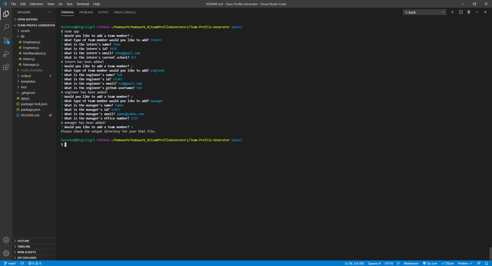

# Team Profile Generator

## Description

This program generates a "team.html" file containing a team of collaboraters based off of user command line input. It will ask you a series of questions and let you add three different types of team members a intern, manager, and engineer. This makes it easy to see contact information for each person on the team in one place. Create your team today for an awesome presentation piece or divide up workloads with the team profile generator!

## Table of Contents

-   [Installation Instructions](#installation-instructions)
-   [Usage Information](#usage-information)
-   [License](#license)
-   [Contribution Guidelines](#contribution-guidelines)
-   [Test Instructions](#test-instructions)
-   [Questions](#questions)

## Installation Instructions

This application requires Node.js which can be downloaded <a href="https://nodejs.org/en/" target="_blank">here</a>. It utilizes a node module called <a href="https://www.npmjs.com/package/inquirer" target="_blank">inquirer</a> and can be installed using <a href="https://www.npmjs.com/" target="_blank">node package manager</a>. Once those dependencies are installed you are ready to generate a team profile!

## Usage Information

The user will follow the prompts to add team members with the choices between a intern, manager, and engineer. There will be different questions associated each team member type. Once the user selects to not add anymore team members a "team.html" file will be generated in an "output" directory.

Click the image below to view the demo video!

## License

This project is utilizing the N/A license

## Contribution Guidelines

This is a fully open source project, you may fork the repository and any pull requests will be viewed and implemented accordingly.

## Test Instructions

For testing you will need to run the app.js with node. The program will the prompt you with the questions and generate a "team.html" when no more team members are selected to be added. The html file will be placed inside an output folder and will create the needed path if it is not present.

## Questions

If there are further questions please contact me with the following.

 AndrewMorrow - <a href="https://github.com/AndrewMorrow" target= "_blank">Github</a>

Email: beardedmongo@gmail.com
